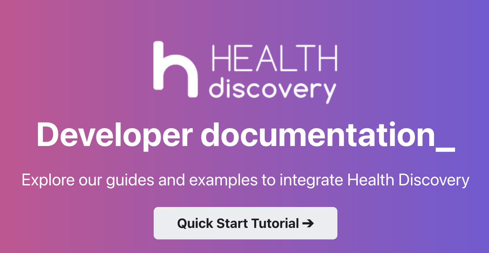

We're excited to present the latest health discovery minor release.

#### Highlights

- COVID-19 Disambiguation in German
- Improved Negation Detection in German and English
- Terminology Improvements for `Anatomies`, `Diagnoses`, `LaboratoryValues` and `Medications`

A blog post folder can be convenient to co-locate blog post images:

